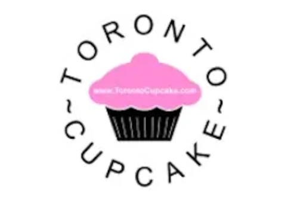

# Introduction

The goal of this project is to redesign a poorly made website to adhere to UI/UX standards, demonstrating our knowledge of design and user experience.  
We will learn in our UI/UX course to identify  issues and implement solutions.  
The result will be a polished mockup of the new site in Figma.

## Possible Websites to Redesign

We found five websites that had UI/UX issues. Those Five websites were:

1. [Stack Overflow](https://stackoverflow.com/questions)
2. [Toronto Cupcakes](https://www.torontocupcake.com/)
3. [Suzanne Collins](https://www.suzannecollinsbooks.com/)
4. [BCIT Student Self Service](https://bss.bcit.ca/owa_prod/twbkwbis.P_GenMenu?name=bmenu.P_MainMnu)
5. [ACT at MIT](https://act.mit.edu/about/)

We eliminated Stack Overflow and BCIT Student Self Service because they had too many pages. Chris agreed with this.

We then eliminated the ACT program at MIT's website as there was too much accessability work to be done, though it was a very interesting visual concept.

Suzanne Collin's site was a strong contender as it had a clear purpose and brand. It needed better page structure and call-to-action buttons. We decided not to go with this site as we felt there was not as much to do.

## Chosen Website

Our chosen website is [Toronto Cupcake](https://www.torontocupcake.com/). It is a cupcake bakery based in Toronto with a focus on catering services for corporate businesses and events.

This website is a great combination of the opportunities the other five websites had.  
 The user experience is very frustrating, specifically when ordering products. The ordering page is not accessible from the menu, but rather from a button on a random page.

The navigation is not to standard and its hierarchy is very unclear. Many options are hidden on certain pages and not included in the main menu.  
The navigation should not be vertical with dropdown options as it is hard to read.

The current brand does not align well with the goals of the business. It lacks professionalism to their corporate audience and looks dated in the eyes of their customers. We will rebrand the site, including a new logo, palette, and typography.

Overall, I think this brand has a very interesting niche which provides us the opportunity to make something exciting!

## My Team

I am working with Anna for this assignment, which will help me better understand common problems I may encounter when working as a team and figure them out in a safe environment.  
It also helps reduce the workload, as this is a large assignment and we have many classes this semester.

## Hopes and Goals

My main goal for this project is to have some real experience working on a project with another dev.  

I hope to be able to apply my design skills successfully in this project.
