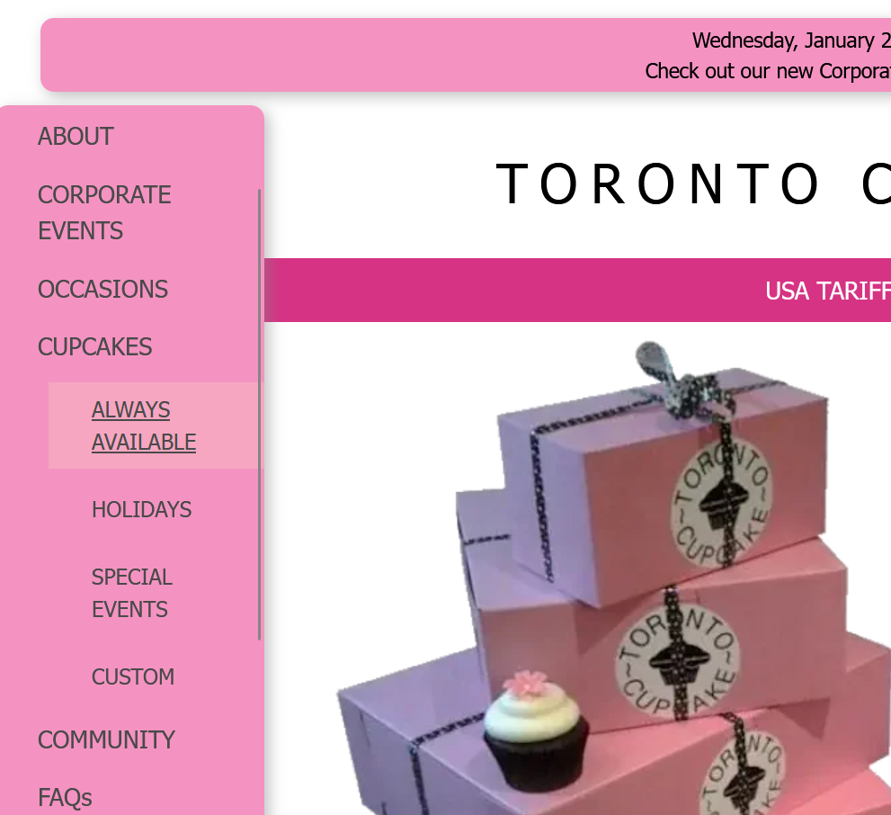
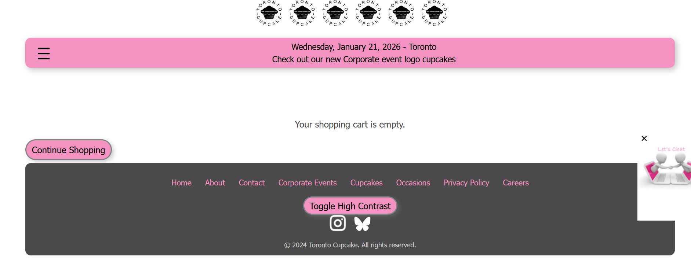
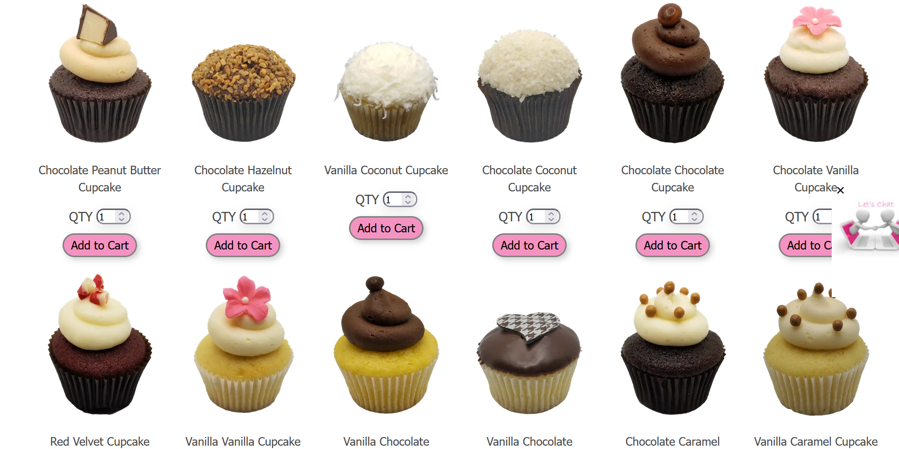
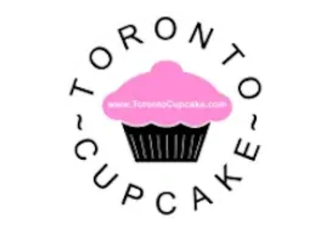
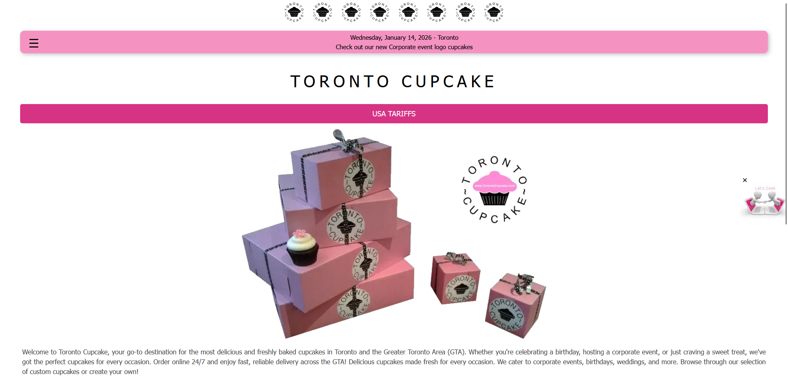
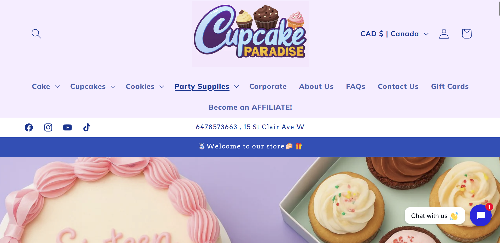
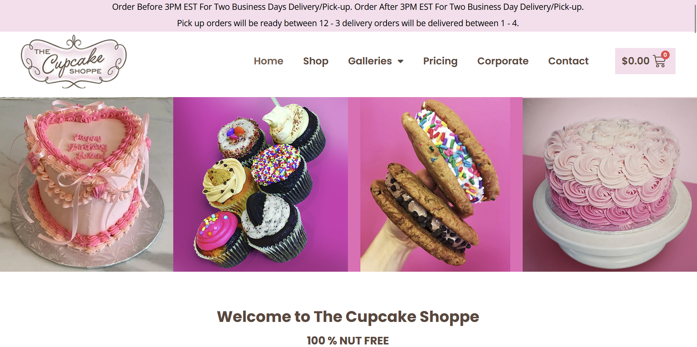

# Project Proposal

In the previous article we discussed a user-focused methodology for UI/UX design and the seven useability factors. Now we can use those tools create a design proposal for Toronto Cupcake.

## Project Goal

Currently, Toronto Cupcake is an outdated and frustrating website to use that lacks **usability**, **desirability**, and **credibility**.

The business claims to be a gourmet cupcakerie with a focus on community, so the goal of this redesign is to reflect that in the visual brand and experience.

## Current Issues

Last week we mentioned a few obvious issues with the site. This week we made those problems more concrete and began to identify their sources.

**Navigation**  
The main menu is hidden from users behind a hamburger menu and is vertical with dropdown options, which is very confusing and hard to look at. The hover states are unprofessional.

**Shop/Catalogue**  
The cart should have a standalone menu button to be accessible from all pages, not hidden at the bottom of the menu.

The cart page itself has a thoughtless layout, negatively impacting it's visual appeal.

To access the catalogue the user must choose from a series of options in the main menu, rather than allowing them to sort the results on a main catalogue page.

It is completely misaligned, lacking important information like price, and all around unprofessional.

**Branding**  
The current design is dated and does not reflect a gourmet bakery. It's pixelated, contains a website link, and is generic.

**Accessability**  
This website does not adhere to accessability standards, especially contrast. It has poor hierarchy and typography which makes it hard for users to read and use.

## Changes to Make

We will rebrand Toronto Cupcake to better reflect an elegant, gourmet cupcakerie with a focus on catering. 

* New Brand (Logo, Palette, and Typography)
* Tasteful animations and hover states
* Correct typographical alignment and hierarchy
* High quality images and icons
* Accessible and clear navigation menu
* Modernized header and footer
* Shop, delivery, and cart functionality improved
    * Cart icon clear and accessible
    * Order confirmation and status
    * Cart page made more clear and appealing
* All redundant information removed

## Market Competitors

We chose two market competitors to research. This helps us see what businesses in Toronto Cupcake's niche are doing well and what we can learn from them.

Both of these companies offer catering services for baked goods and are located in Toronto ON. They are of similar status as well; not exceptionally well known, but clearly serious about their business.

### Cupcake Paradise

[Cupcake Paradise](https://www.cupcakeparadise.ca/) is a bakery with catering services and a focus on allergen free and custom products.

Their website design, while looking a little AI generated, is trendy, modern, and functional. The animations are tasteful and the colour palette suits their playful brand. Their purpose is stated clearly in their homepage with various call-to-action buttons throughout, guiding the user to make a purchase.

However, the AI graphics appear unprofessional and a lack of focus on community detracts from its desirability and value. The UI is slightly crowded and the constant animations make it a little annoying to navigate.

### The Cupcake Shoppe

[The Cupcake Shoppe](https://thecupcakeshoppe.ca/) Is a nut free bakery located in Toronto. Their selection is quite large and they also provide catering services.

This website is a little more dated and less trendy than Cupcake Paradise, but their branding is elegant and traditional. Their UI is very clean and as a result, makes their website look credible. They utilize cards depicting their different products right on the homepage, allowing users to quickly see what is available.

There are a few issues, most obvious the low quality images and dated design. The use of whitespace on some pages do not look intentional and make the design look incomplete or empty.

This analysis tells me that in order for our redesign to be successful, we need:

* A homepage with an appealing splash image
* Call-to-action buttons
* Clear understanding of the products sold
* Tight and purposeful design

With this completed, we can now move on to better understanding our user's needs.

[Next Article - User Personas, Stories, and Scenarios](week3.md)
