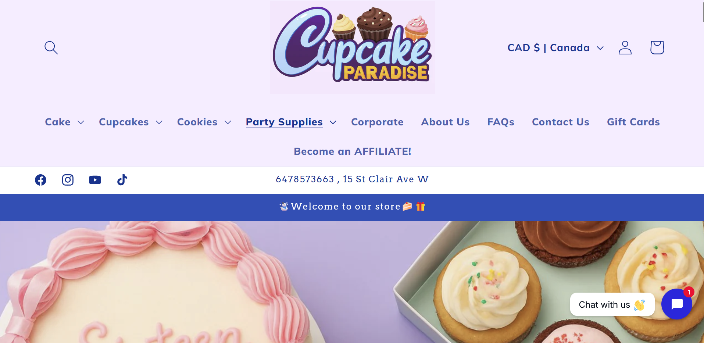

# Project Proposal - Week Two

This week we discussed how to go about a UX/UI project, including the 5 step methodology and 7 usability factors. We also completed a design proposal and researched some market competitors for our chosen website.

## Five Step Method

Chris outlined a five step method we can use to start a UI/UX project. This method is **user focused**, meaning that we design with the user's experience at the forefront of our minds.

### 1. Empathise

Think of any issues that the user might encounter while using your product. Put yourself in their shoes. How well does the product help a user in accomplishing their goals?  

### 2. Define

Take those problems you thought of and make them more concrete. What is the exact problem the user is facing? What is causing those problems? What are the factors involved?

### 3. Ideate

Start thinking of solutions to these problems. How can we help the user accomplish their goals in the fastest and most effective way possible?

### 4. Prototype

Take the best solutions you thought of and start to implement them. How will they fit into the current design? How will it affect the current user experience?

### 5. Test

Take your prototype and test it on a smaller group of people. Get feedback on your design and find the holes in your solution. Fix issues you encounter and refine your solutions to best meet the needs of your users.

## Seven Usability Factors

The seven usability factors help us the possible barriers  a user might encounter while using our application.

### Useful

If the application is not useful, nobody wants to use it! A web app should solve a specific problem effectively for a user to find it useful.  
For example, many people find Adobe products to be less useful than they were before they were stuffed with more features. This makes the product do a lot of things, but also makes it not particularly useful for anything specific.

### Usable

If a product is not useable, users simply cannot use it.  
A good example of this is Wikipedia. If there was no good page hierarchy, navigation systems, links, or references, it would be a mess of articles nobody could read. Wikipedia is very useable thanks to it's SEO, powerful navigation, and excellent use of links.

### Findable

If a website is not findable, none of these other factors will matter. Good SEO and use of semantic tags is vital for helping users find your product in the vast ocean of the web.  
Examples of this are small blogs and other websites which do not use semantic tags to utilize browser's search optimization.

### Credible

Anybody can create a site, so it's important that your site is credible in order for users to trust it. Poor design can easily influence a user's decision to trust your site or not.  
A good example of this is tabloid style news sites which cover their pages in outrageous titles, poor quality photos, ads, and lack authors with an education. Educated people will see these things and quickly decide that the site is not trustworthy.

### Desirable

Aesthetics and trends play a large part in what products users decide to use. It's so powerful that sometimes a product doesn't need to be useful or useable for it to be desired.  
There are millions of examples of this, but arguably the biggest ones are social media. It provides no real value to our lives and has been proven to do more bad than good, and yet FOMO is a driving factor of what keeps users on these apps. The desire for connection, views, and likes outmatches any amount of physical or mental harm they might do.

### Accessible

Users might not use your product simply because they can't. Any amount of disabilities, from vision, movement, or cognitive function might prevent a user from being able to use a product well.  
A common web example is colour blindness. If your site lacks contrast or uses a palette that is not easily visible to everyone, those affected users simply will nto use it.

### Valuable

Lastly, your product must add value to the user in some way. Otherwise, what's stopping them from using another product or service?  
An example of this is something like MapQuest. An outdated platform that is easily outdone by the default map app on your phone provides no value to a user. It has no unique features that makes it any more valuable than GoogleMaps or Waze.

## Design Proposal

Now that we understood these tools, it was time to use them to define the issues with Toronto Cupcakes and create a design proposal that outlined how we would fix them.

### The Goal

Currently, Toronto Cupcakes is an outdated and frustrating website to use that lacks usability, desirability, and credibility.  
It claims to be a gourmet cupcakerie with a focus on community, so the goal of this redesign is to make it look and function that way for its users.

### Current Issues

Last week we mentioned a few obvious issues with the site. This week we defined those issues better.

1. Navigation  
The main menu is hidden from users behind a hamburger menu and is vertical with dropdown options, which is very confusing and hard to look at. The hover states are unprofessional.

2. Shop/Catalogue
The cart is not easily accessible to users from all pages and is designed poorly.

The catalogue is very unappealing and hard to use. It is completely misaligned and all around dated and unprofessional.

3. Branding
The current design is outdates and unappealing. It does not cater to their audience or reflect what they want to be, which is gourmet. The logo is unprofessional and sloppy and the colour palette is childish.

4. Website Design
The website does not adhere to proper accessability standards like contrasting colours. It has poor hierarchy, typography, and overall does not looked professional.

### Changes to Make

We will rebrand Toronto Cupcake to better reflect an elegant, gourmet cupcakerie with a focus on community.

The website design will be professional and polished with tasteful animations and hover states, correct alignment, padding, and margin, professional icons and photos, and proper hierarchy.  

The navigation will be horizontal and accessible on desktop at all times. All menu options will be included.  

The header and footer will be modernized with unnecessary information such has the date removed.  

The shop, delivery, and cart functions will all be made much clearer and easier to find/use.  
The catalogue will be made much more appealing and understandable with uniform spacing, proper images, and with the pricing information easily seen.  

Redundant pages and information will be removed, such as repeated questions on the FAQ page, the delivery page, and the resources and occasions pages combined for simplicity.

## Market Competitors

We chose two market competitors to research that were both bakeries in the greater Toronto area.

### Cupcake Paradise

[Cupcake Paradise](https://www.cupcakeparadise.ca/) is a bakery with catering services and a focus on allergen free and custom products.

Their website design, while looking very AI generated, is trendy, modern, and functional. The animations are tasteful and the colour palette suits their playful brand.

The AI generated images and logo could make it appear unprofessional to some users, and a lack of focus on community detracts from its desirability and value. Additionally, the UI is slightly crowded and the constant animations might make it a little unusable.

### The Cupcake Shoppe

[The Cupcake Shoppe](https://thecupcakeshoppe.ca/) Is a nut free bakery located in Toronto. Their selection is quite large and they also provide catering services.

Their website is a little more dated and less trendy than Cupcake Paradise, but their branding is very elegant and professional. Their UI is very clean and as a result, makes their website look credible.

However, their unclear photos and lack of community makes them less desirable and valuable.
