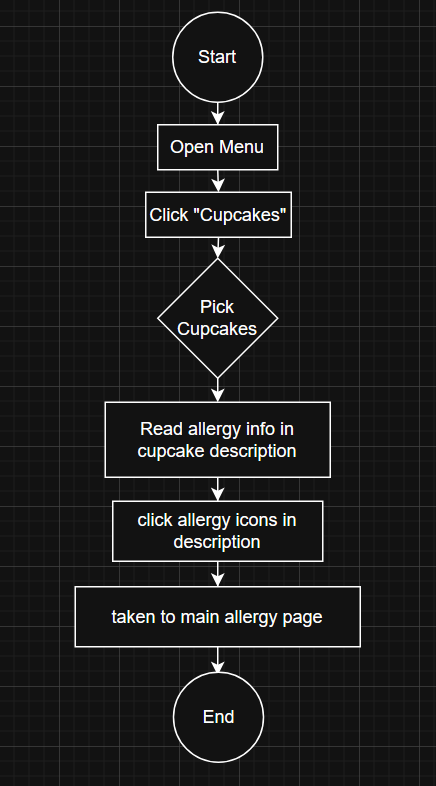
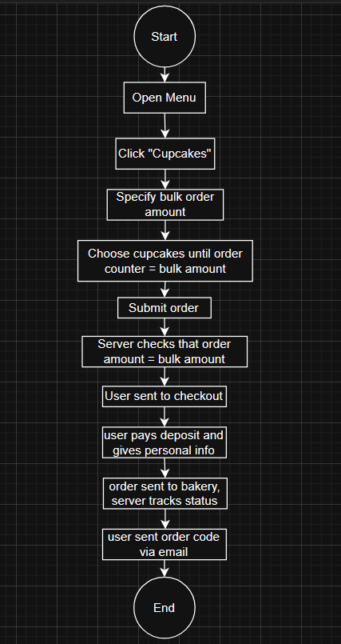

# User Flows

User flows are based on user stories. They outline how a user would go about accomplishing the goal in their story using your application in a flowchart manner.

We created three user flows to begin to identify what elements our redesign will need and where they should be on the actual page.

## User Flow One

The user story for this flow is:

>As an assistant ED, I want to know the specific time and place my cupcake order will be delivered so that I can plan accordingly.

Here's how that looks as a user flow:

You can begin to see how this would help a developer identify elements they need for their website. For example, this user flow highlighted the fact that we need a way for the user to be able to get an order code to track their order.

## User Flow 2

User Story:

>As a wedding planner, I want to easily learn about allergens of different cupcakes, so that I can order cupcakes suitable for all my guests.

User Flow:

This user flow highlighted the fact that we need allergen information to be accessible in multiple places so that the user was never left wondering about the contents of the item.

## User Flow 3

User Story:

>As a wedding planner, I want to easily order cupcakes in bulk, so that I can have an easier time organizing my wedding

User Flow:

Finally, this user flow demonstrated to us just how in depth the order page would have to be. Although we are just mocking-up the redesign, this would have shown us how the server would play an integral role in the ordering system had we actually been coding this out.

With these three user flows, we are now ready to begin sketching out some wireframes to represent them.

[Next Article - Low-fi Wireframes](./week5-2.md)
