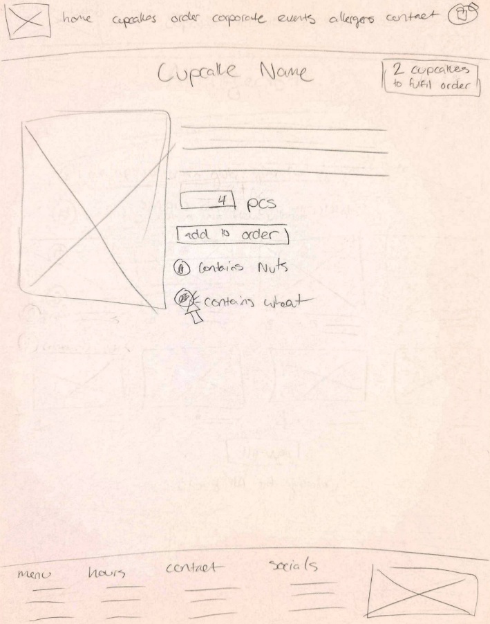
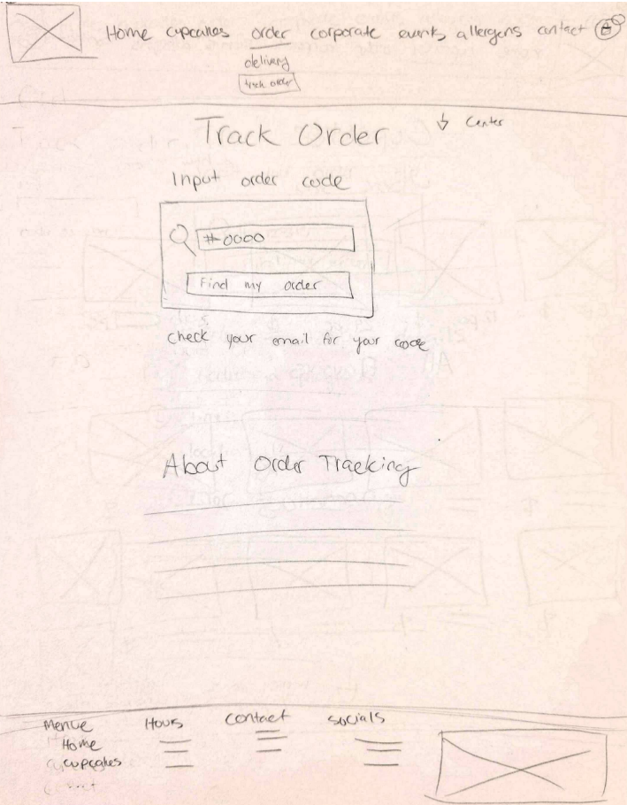

# Low-Fi Wireframes

We began to plot out what our website will look like by creating low-fi wireframes based on our user flows.

Low-fidelity or low-fi wireframes are very simple sketches of how you want an application to look, focusing purely on the user's experience.

## Toronto Cupcake Wireframes

Here are a few of the most important pages of our website as low-fi mockups. 

### Homepage

### Cupcakes Page

### Cupcake Page

### Order Page

The goal of low-fi mockups is to get a basic understanding of where things need to be for the user to have the best experience. 

At this stage, we don't care about what images go where, what colours, will be used, etc. That comes next!

[Next Article - Style Guide](week6.md)
