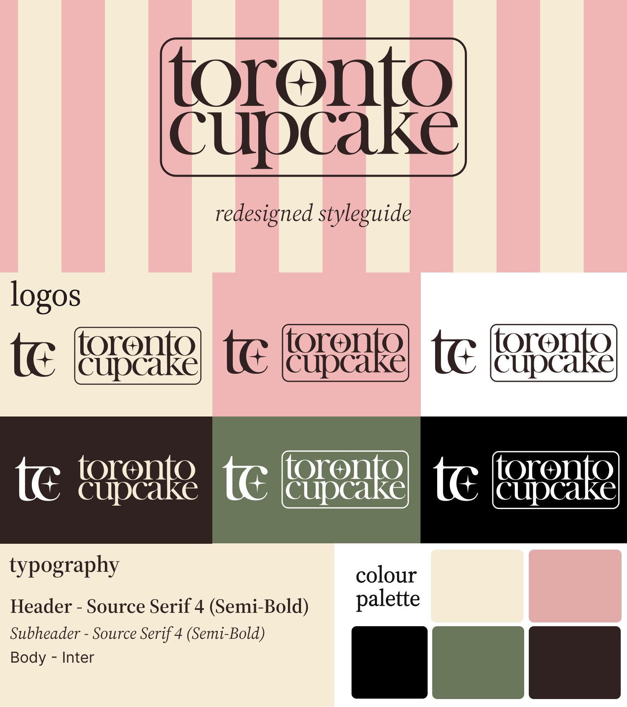
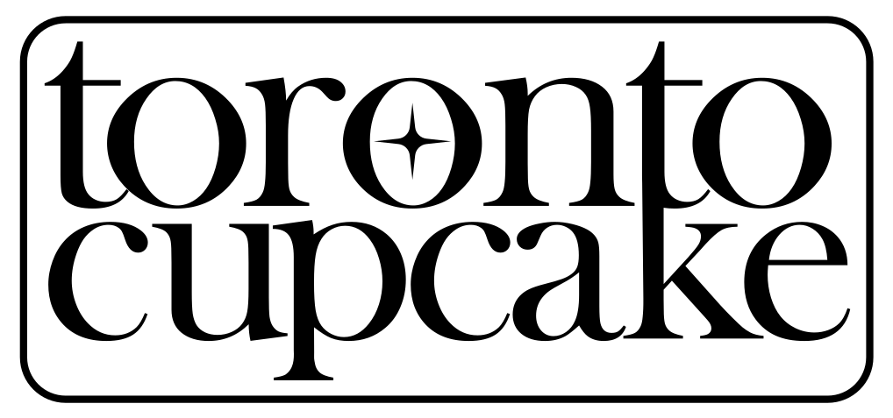

# Rebrand

This article will detail our redesign of Toronto Cupcakes, including a style guide and design rationale.

## Logo

The wordmark for Toronto Cupcake takes inspiration from traditional French bakery styles.

The bold serif font is strongly associated with trust, professionalism, and longstanding businesses, all features that Toronto Cupcake wants to promote to their corporate audience.

The T and the K share a stem for some added flare and as a small nod to the CN tower, a famous landmark of Toronto. This makes their logo a little more personalized and better represent where they are located.

A star in the middle O represents their status as one of Canada's first gourmet cupcakeries and is connected to concepts like high reviews and fame.

Lastly, the border around the logo neatly contains the typography to resemble a stamp. The purpose of this iconography is to invoke ideas of professionalism and class, like an official seal.

The letter mark is simple yet elegant, utilizing the same serif font and some decorative flourishes connecting the 't' and 'c' for some added visual interest. Selective corners are rounded to appear a little more abstract and artistic to match their creative products.

Again, the star appears to represent their company as one of high quality and reputation, a shining star in their community.

The choice to make both logos lowercased was to follow the current design trend in typographical logos. Lowercased logos are often associated with modern styles and companies, and is just what Toronto Cupcake needs to bring it back into current year.

## Colour Palette

We chose colours for this brand pulled directly from photos of pastries and cupcakes, later refined to a complimentary colour scheme of pink and green. I made the decision to pull from a real life photo for an even deeper connection to the company's products.

**Primary Colour**

This dusty pink combines both the playful nature of a bakery with a more corporate and professional tone.

**Secondary Colour**

This deeper green colour serves to balance the brighter pink, its depth adds a little more maturity to the palette.

**Background Colours**

This beige serves as a background colour, warming the composition and appearing more friendly and intentional as opposed to white.

This chocolatey brown is alternative background colour to help lighter coloured images stand out.

## Typography

The typography for this brand follows a common pattern in design: A serif header/subheader and a sans-serif body font. This accomplishes a timeless and classy feel while maintaining a modern and readable look for the web.

**Header -** Source Serif 4 - Semi-Bold  
This serif font is bold, classic, and professional with a little personality. It's perfect for showcasing Toronto Cupcake as serious to it's corporate clients, and a little playful to it's public clients.

**Subheader -** Source Serif 4 - Italics  
Italic headers are part of a popular design trend and are also considered to be very elegant. This combination serves the design well, presenting as both aesthetically pleasing and professional. Being italicized, the extra flourishes compliment the more rigid structure of the header font well.

**Body -** Inter  
Inter is a very popular font known for it's readability and professionalism. The sans-serif font is a welcome modern addition to the typography, establishing that Toronto Cupcake's serif headers are a modern design choice.

The next article will show off the final high fidelity product prototyped in Figma.

[Next article - Hi-Fi Prototype](week7.md)
