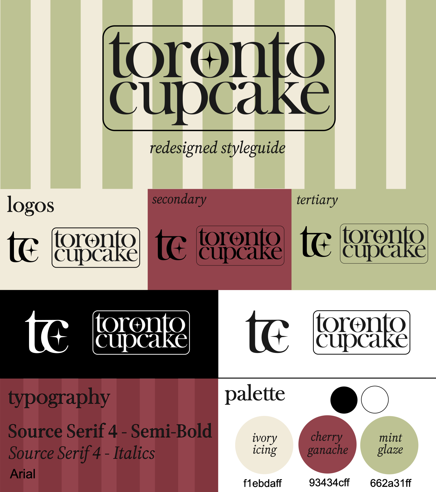
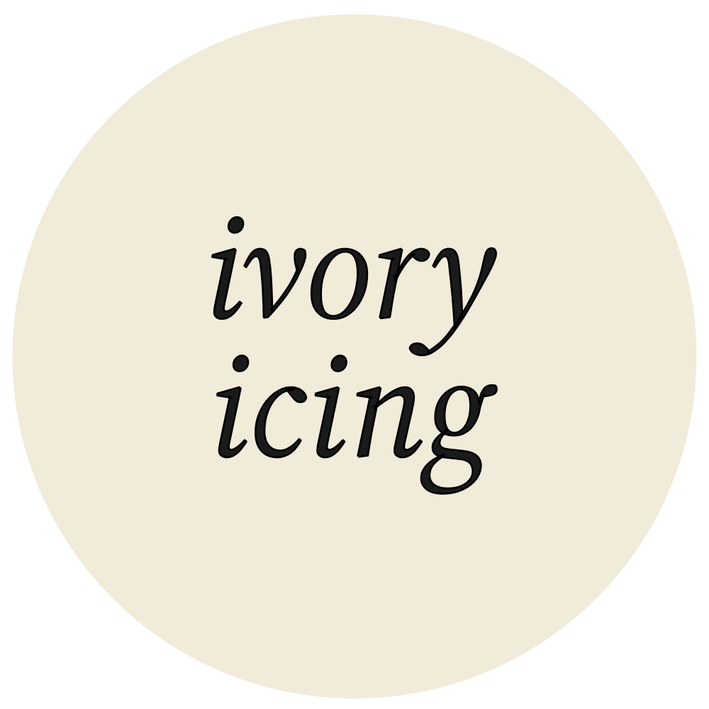
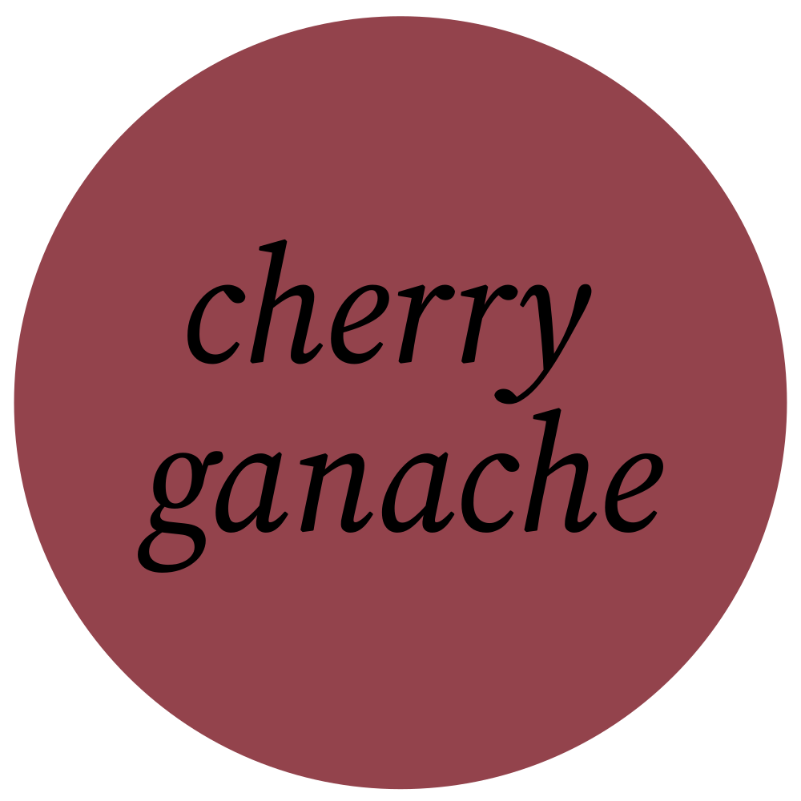
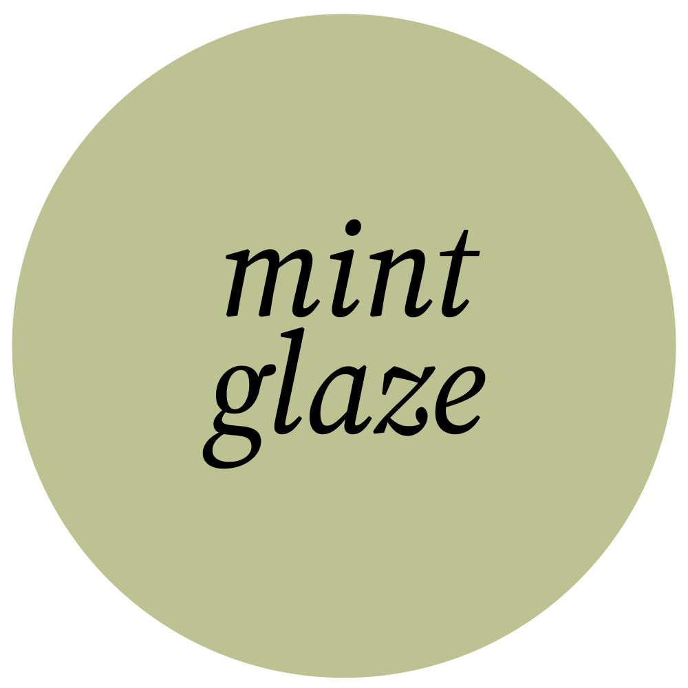

# Rebrand

This article will detail our redesign of Toronto Cupcakes, including a style guide and design rationale.

## Logo

The wordmark for Toronto Cupcake takes inspiration from traditional French bakery styles.

The bold serif font is strongly associated with trust, professionalism, and longstanding businesses, all features that Toronto Cupcake wants to promote to their corporate audience.

The T and the K share a stem for some added flare and as a small nod to the CN tower, a famous landmark of Toronto. This makes their logo a little more personalized and better represent where they are located.

A star in the middle O represents their status as one of Canada's first gourmet cupcakeries, and is connected to high reviews and fame.

Lastly, the border around the logo neatly contains the typography to resemble a stamp. The purpose of this iconography is to invoke ideas of professionalism and class, like an official seal.

The letter mark is simple yet elegant, utilizing the same serif font and some decorative flourishes connecting the 't' and 'c' for some added visual interest. Selective corners are rounded to appear a little more abstract and artistic to match their creative products.

Again, the star appears to represent their company as one of high quality and reputation, a shining star in their community.

The choice to make both logos lowercased was to follow the current design trend in typographical logos. Lowercased logos are often associated with modern styles and companies, and is just what Toronto Cupcake needs to bring it back into current year.

## Colour Palette

We chose colours for this brand pulled directly from photos of pastries and cupcakes, later refined to a complimentary colour scheme of red and green. I made the decision to pull from a real life photo for an even deeper connection to the company's products.

**Primary Colour**

This pale beige colour serves as the background colour for most pages. It's warm yellow tint makes it softer than a harsh white, and invokes feelings of nostalgia, comfort, and elegance.

**Secondary Colour**

Cherry Ganache is a silky deep red with purple tones. It's regal and elegant, reminiscent of a red velvet cupcake. It's main use is for buttons, highlight text, or any other items on screen that should attract a user's attention. It can also serve as a statement background colour for more moody vibes.

**Tertiary Colour**

Mint Glaze is a highlight colour, most often used against Ivory Icing as a gentle background pattern. It's contrast is quite low, so it's meant purely for decorative purposes only. Occasionally, it may replace Ivory Icing as the background colour for a page where few other colours are used. The light green colour is calming and refreshing, not unlike a mint leaf garnish.

Lastly, black is used for all text and any other areas where high contrast is required.

## Typography

The typography for this brand follows a common pattern in design: A serif header/subheader and a sans-serif body font. This accomplishes a timeless and classy feel while maintaining a modern and readable look.

**Header -** Source Serif 4 - Semi-Bold  
This serif font is bold, classic, and professional with a little personality. It's perfect for showcasing Toronto Cupcake as serious to it's corporate clients, and a little playful to it's public clients.

**Subheader -** Source Serif 4 - Italics  
Italic headers are part of a popular design trend and are also considered to be very elegant. This combination serves the design well as it presents as both aesthetically pleasing and professional. Being italicized, the extra flourishes compliment the more rigid structure of the header font well.

**Body -** Arial  
Arial is a very popular and well known font for it's readability and professionalism. The sans-serif font is a welcome modern addition to the typography, ensuring that Toronto Cupcake's serif headers are a modern design choice and not too aged.
