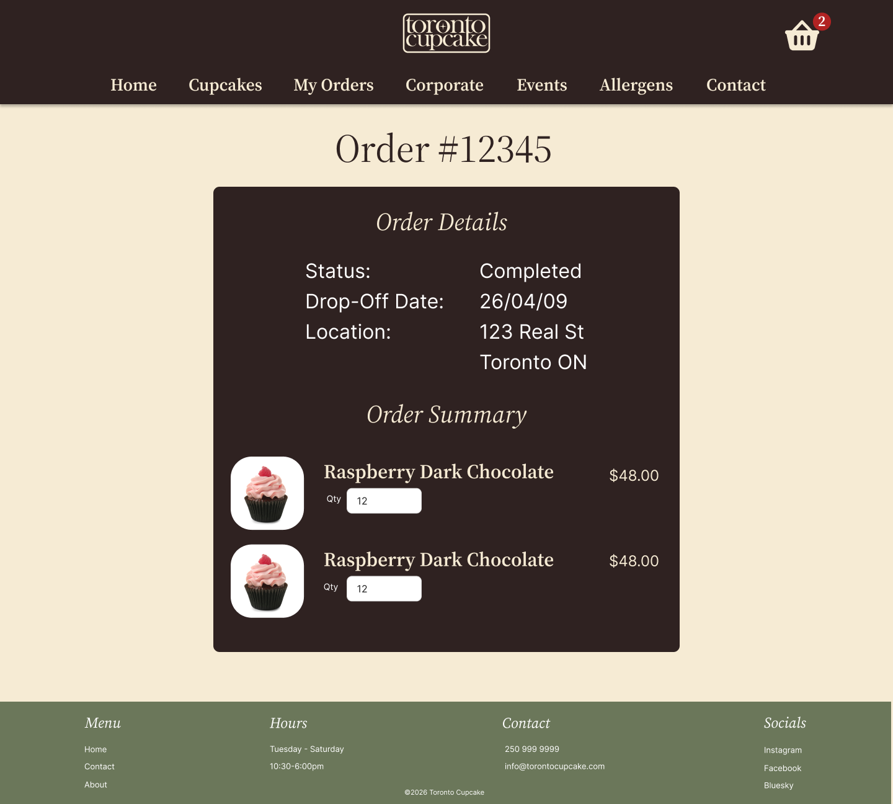

# High-Fidelity Prototype

This article will discuss the creation and testing of the hi-fi prototype in Figma. It will also showcase a few of the site's main pages.

## Hi-Fi Testing

Our Hi-Fi testing was very successful in that there was not a lot of changes to be made. Some minor visual things such as consistent alignment and the re-ordering of some sections was our main feedback.

Users were able to successfully accomplish the goals outline in our user scenarios with little to no confusion, meaning we were successful in our goal to improve the useability of this site.

## Highlighted Pages

Here are the most important pages that were redesigned/added to this website in order to improve it's useability.

### Homepage

We wanted the homepage to have three main improvements: a splash image for appeal, call-to-action buttons for direction, and sections depicting Toronto Cupcake's products and services right off the bat.

### Catalogue Page

The catalogue page needed to be cleaned up, properly aligned, and have the images replaced with higher quality ones. Some functionality needed to be improved as well, such as the price and ordering system made more clear, as well as the ability to quickly add items to the cart.

### Item Page

There was previously no way to select a specific cupcake and be taken to a page with more details, so that functionality has been added to our redesign. It also contains allergy information and the ability to add a specific quantity to the cart.

### Cart Page

The cart page now explains how the ordering and payment processes work, as well as shows the items in the cart in a much more clear and appealing way.

We also added the ability for the user to leave a note to the baker, as little changes like icing colour or filling are very common. Additionally, there is a section explaining how the payment process works so that no user is left wondering.

### Review Order Page

This page clearly outlines all the information a customer would need to know about their order, as well as provides instructions for viewing this information at any time. This functionality further clarifies the ordering processes and next steps for the user.

## Next Steps

With the main pages of Toronto Cupcake redesigned and prototyped in Figma, I am now looking to code the website out on my own time. Upon completion, you will be able to find a link to the repository here.

## Final Thoughts

I am exceptionally happy with how this redesigned turned out. We accomplished all that we set out to, and I was able to push my design skills to the test. The new website is extremely useable and the new brand is not only appealing but better reflects what the company wants to be.

Thank you for taking the time to read this project documentation, and if my work here interests you I'd be happy to connect on [LinkedIn](https://www.linkedin.com/in/ava-david-998b89353/).
